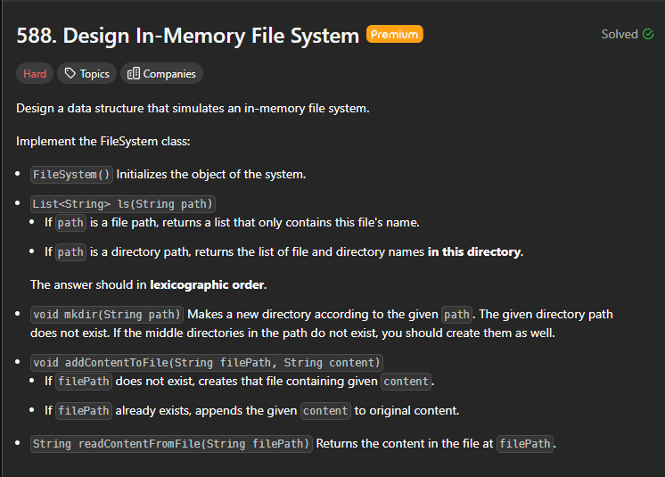
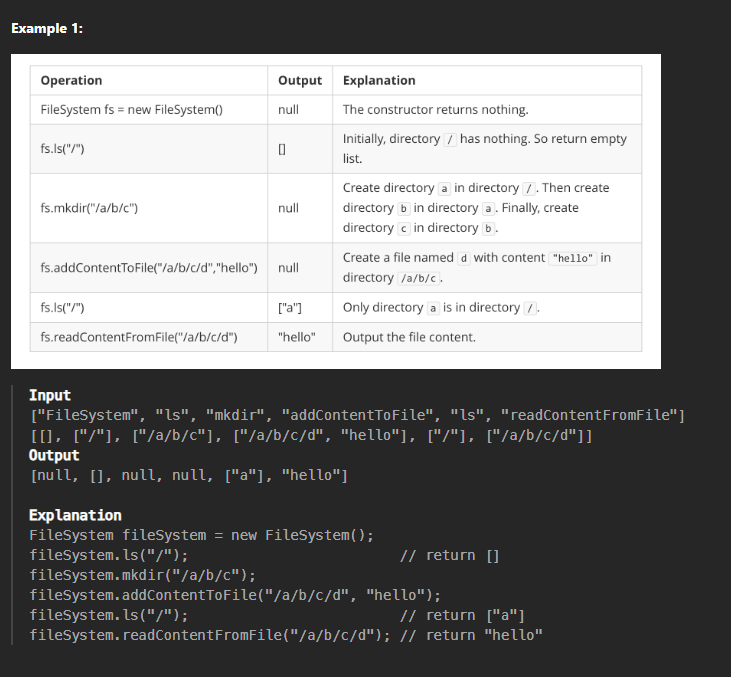
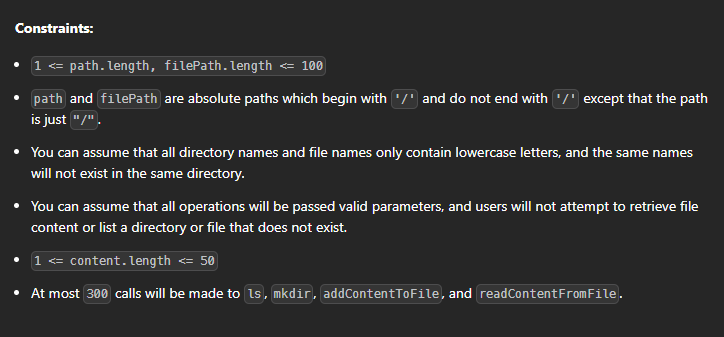

## Design In Memory File System




Solution :

```
class Directory {
public:
    string name;
    map<string, Directory*> directories;
    map<string, string> files;
    Directory(string name) { this->name = name; }
    vector<string> getAllFiles() {
        vector<string> ans;
        for (auto x : directories) {
            ans.push_back(x.first);
        }
        for (auto x : files) {
            ans.push_back(x.first);
        }
        sort(ans.begin(), ans.end());
        return ans;
    }
};

class FileSystem {
public:
    Directory* root;
    FileSystem() { root = new Directory("root"); }

    vector<string> getTokens(string input) {
        stringstream ss(input);
        string word;
        vector<string> tokens;
        while (getline(ss, word, '/')) {
            tokens.push_back(word);
        }
        return tokens;
    }

    Directory* getLastDirectory(string path) {
        vector<string> tokens = getTokens(path);
        Directory* curr = root;
        int n = tokens.size();
        for (int i = 1; i < (n - 1); i++) {
            curr = curr->directories[tokens[i]];
        }
        return curr;
    }

    vector<string> ls(string path) {
        if (path == "/")
            return root->getAllFiles();
        Directory* curr = getLastDirectory(path);
        vector<string> tokens = getTokens(path);
        int n = tokens.size();
        string s = tokens[n - 1];
        if (curr->directories.find(s) != curr->directories.end()) {
            return curr->directories[s]->getAllFiles();
        } else {
            return {tokens[n - 1]};
        }
    }

    void mkdir(string path) {
        vector<string> tokens = getTokens(path);
        int n = tokens.size();
        Directory* curr = root;
        for (int i = 1; i < n; i++) {
            string s = tokens[i];
            if (curr->directories.find(s) != curr->directories.end()) {
                curr = curr->directories[s];
            } else {
                curr->directories[s] = new Directory(s);
                curr = curr->directories[s];
            }
        }
    }

    void addContentToFile(string filePath, string content) {
        Directory* curr = getLastDirectory(filePath);
        vector<string> tokens = getTokens(filePath);
        int n = tokens.size();
        string s = tokens[n - 1];
        if (curr->files.find(s) != curr->files.end()) {
            curr->files[s] = curr->files[s] + content;
        } else {
            curr->files[s] = content;
        }
    }

    string readContentFromFile(string filePath) {
        Directory* curr = getLastDirectory(filePath);
        vector<string> tokens = getTokens(filePath);
        int n = tokens.size();
        string s = tokens[n - 1];
        return curr->files[s];
    }
};

/**
 * Your FileSystem object will be instantiated and called as such:
 * FileSystem* obj = new FileSystem();
 * vector<string> param_1 = obj->ls(path);
 * obj->mkdir(path);
 * obj->addContentToFile(filePath,content);
 * string param_4 = obj->readContentFromFile(filePath);
 */
```